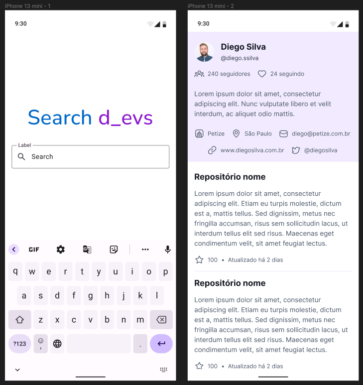
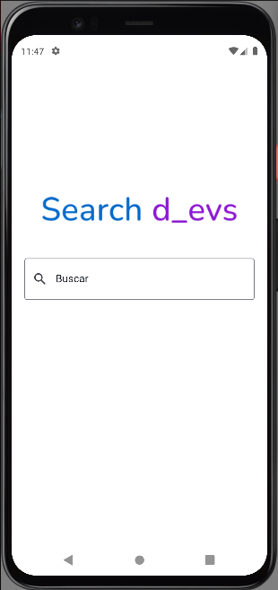
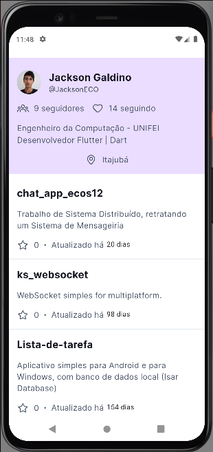

# Search Devs

## Instalando  o projeto

* Inicialmente deve deve todo o ambiente flutter configurado, caso tenha alguma dúvida utilize sempre a [documentação oficial](https://docs.flutter.dev/get-started/install)

* Clone este repositório em sua ultima versão: 

```
git clone https://github.com/JacksonECO/search_devs.git
```

* Para executar em um dispositivo android, inicialize seu emulador ou realize a conect seu dispositivo via porta usb.

Caso esteja utilizando um dispositivo físico e seja sua primeira vez, é necessário ativar em seu dispositivo o modo desenvolvedor e em seguida ativar a depuração USB (para mais informações acesse [developer.android.com](https://developer.android.com/studio/debug/dev-options?hl=pt-br#enable))

* Execute para rodar em modo de desenvolvimento (debug)

```
flutter run
```

* Executer para gerar um aplicativo em modo de release

```
flutter build apk
```

* Para instalar o aplicativo de release em seu smartphone:

  * Tenha o aplicativo (arquivo .apk) em seu dispositivo, pode ser enviado por exemplo via whatsapp ou explorador de arquivos. Para baixar este aplicativo click [aqui](https://github.com/JacksonECO/search_devs/releases/download/v1.0.0/search_devs_v1.0.0+1.apk)

  * Em seguida tente click em cima abrir

  * Por segurança, inicialmente será bloqueado. Para liberar click em configurações e em seguida de acesso ao aplicativo

  * Agora é so voltar e tentar abrir novamente e clicar em instalar. Pode aparecer algumas novas solicitações de segurança, aceite-as e a instalação irá continuar.

  * Prontinho! Aplicativo instalado com sucesso;


## Funcionalidades do aplicativo

• Ao entrar na home page, devo conseguir pesquisar o usuário pelo seu username do GitHub e ter os dados do usuário exibidos corretamente na página de perfil.

• Na página de perfil, os repositórios devem ser ordenados com o seguinte critério: dos que têm mais estrelas, para os que têm menos estrelas.

• Os nomes dos repositórios devem ser links que levam ao repositório original do GitHub de alguma forma.

• Caso o usuário pesquisado possua um site nas informações de seu perfil, deve haver um botão que ao clicar abra aquele site. O mesmo deve acontecer caso o usuário pesquisado tenha uma conta no twitter em seu perfil.

• O botão de voltar deve levar de volta para a home page, para que outro usuário do GitHub
seja pesquisado.

• Seguir o Design:




## Bibliotecas Utilizadas

Todo a interface do aplicativo foi desenvolvida do zero utilizando apenas estruturas fornecidas pelo Flutter em sua ultima versão (v3.3.9)

* Foi utilizado o flutter_modular para realização para injeção de dependências e navegação do aplicativo, que contava com dois módulos ( '/home' e '/profile')

* Para controle de estado foi utilizado o padrão bloc e para facilitar no desenvolvimento foi utilizado o pacote bloc e o flutter_bloc. O primeiro que simplifica a utilização do stream para o bloc e o segundo que fornece os Widgets necessário.

* Para realizar as requisições HTTP com o servidor do GitHub foi utilizado o pacote http;

* Foi utilizado o url_launcher para abertura de uma pagina web ao fornecer sua url.

* Ao utilizar o google_fonts foi possível trocar a fonte do aplicativo de maneira a seguir o protótipo. Para não ter problema em tempo de execução foi realizado a inserção da fonte via assect.

* Foi utilizado do flutter_svg para que seja possível a visualização deste formato de imagem. Foi utilizado para criar os icons.

* Por fim, em ambiente de teste foi utilizado do mocktail para facilitar a criação de mocks. Foi utilizado uma implementação baseado nele o mocktail_image_network, que realiza um override do sistema HTTP nativo do aplicativo permitindo assim que seja possível realizar um mock de um estrutura nativa do flutter, no caso o NetworkImage.


## Estrutura Modula

Como já comentado, foi utilizado do padrão modular para a criação do aplicativo, que consiste em dividir o aplicativo em módulos totalmente independentes, com isso facilitando na manutenção e até mesmo na reutilização de módulos em aplicativo posteriores. Para evitar a duplicidade exitem áreas de compartilhamento de dados, que podem ser usado por mais de um modulo.

Por todas as vantagens deste padrão, o seu antecessor monólito vem perdendo espaço no mercado atual. Diferente do modular o monólito consiste na utilização de apenas um modulo com estruturas muito atreladas a um único elemento.


## Design final


| | |
|:-------------------------:|:-------------------------:|
||
